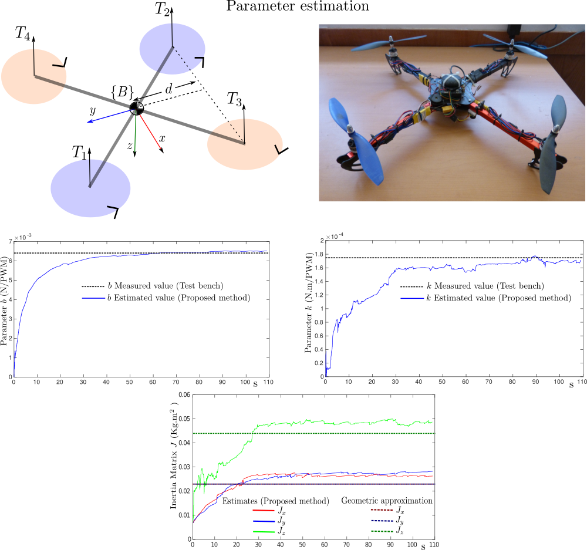

# EKF-Based Parameter Identification of Multi-Rotor Unmanned Aerial Vehicles Models

MATLAB/Simulink code for paper: 

*EKF-based parameter identification of multi-rotor unmanned aerial vehicles models,
R Munguía, S Urzua, A Grau,
Sensors 19 (19), 4174.*

**Instructions:**
- Open folder Simulink_v1/ in Matlab.
- Run the following file to load parameter values into the workspace: parameters.m
- Open Simulink model: mavsim_L_t.slx (R2023b)
- Run the model

